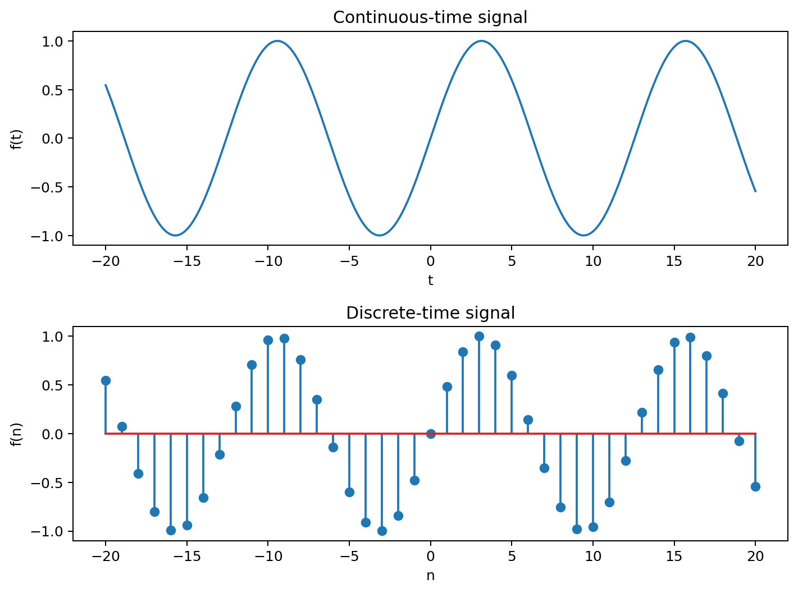
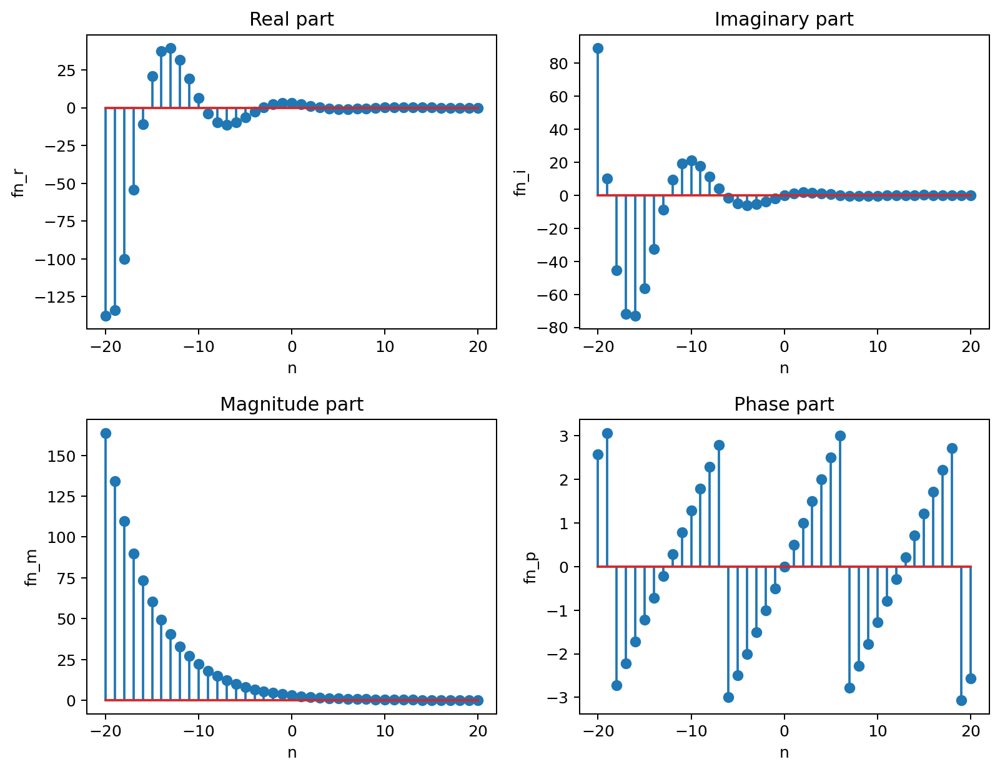
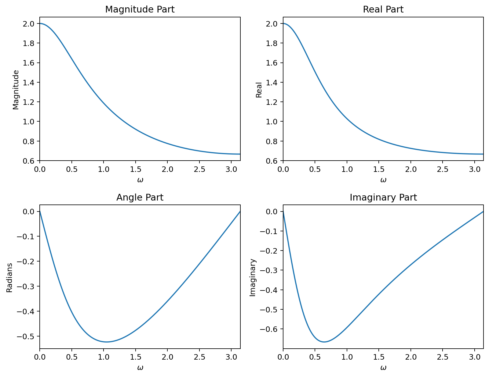
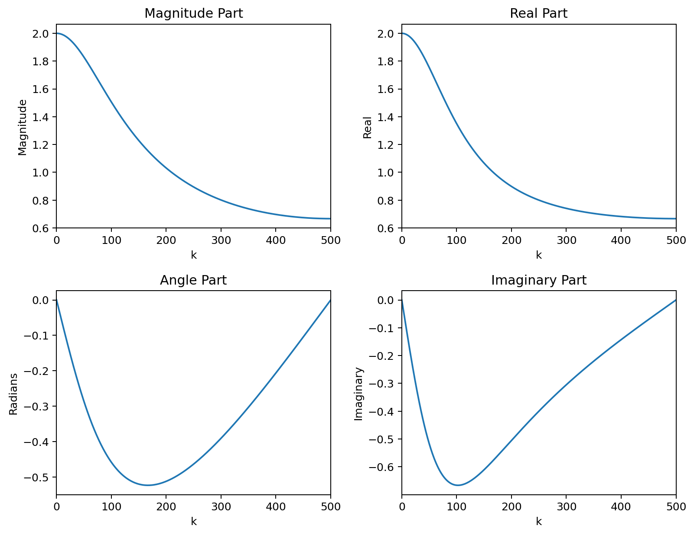
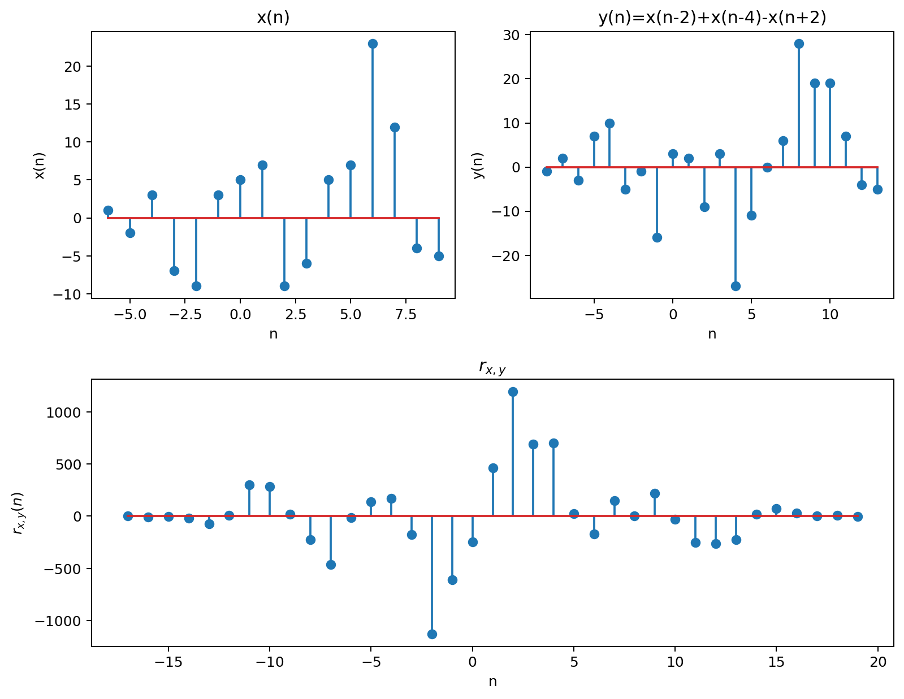
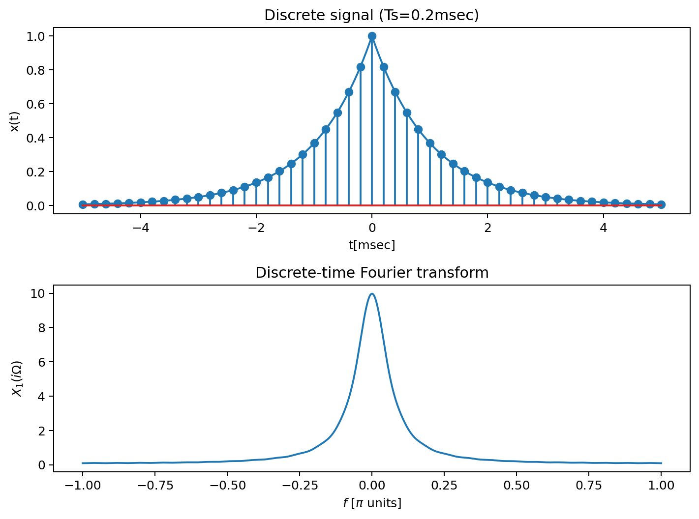

# Signal Processing with MATLAB

This repository contains MATLAB implementations and simulations developed as part of undergraduate laboratory work in signal processing and Fourier analysis.

The projects focus on:
- continuous and discrete-time signals
- Fourier analysis
- convolution and correlation
- signal sampling and spectral analysis

The repository emphasizes computational approaches to classical signal processing concepts through numerical simulations and visualization.

## Example Topics

- Fourier spectrum analysis
- Continuous and discrete signal representation
- Convolution and cross-correlation
- Signal sampling and reconstruction
- Complex exponential signals

## Repository Structure

### 01-continuous-discrete-signals
Simulation and visualization of continuous and discrete-time signals, including complex-valued sequences.

### 02-fourier-analysis
Numerical and analytical Fourier transform implementations and spectrum analysis.

### 03-convolution-correlation
Discrete-time convolution, auto-correlation and cross-correlation simulations.

### 04-sampling-fourier-transform
Sampling theory demonstrations and continuous-time Fourier transform analysis.

## Concepts and Techniques

- Digital Signal Processing (DSP)
- Fourier Transform
- Continuous and Discrete-Time Signals
- Signal Sampling
- Convolution and Correlation
- Complex Signal Representation
- MATLAB Numerical Computing
- Signal Visualization

## Tools

- MATLAB

## Example Outputs

### Continuous and Discrete-Time Signal

### Complex Discrete-Time Signal

### Fourier Analytical Response

### DTFT of Exponential Sequence

### Cross-Correlation Example

### Sampling Example

The example output figures were exported for visualization purposes, while the main implementations are provided as MATLAB scripts.
